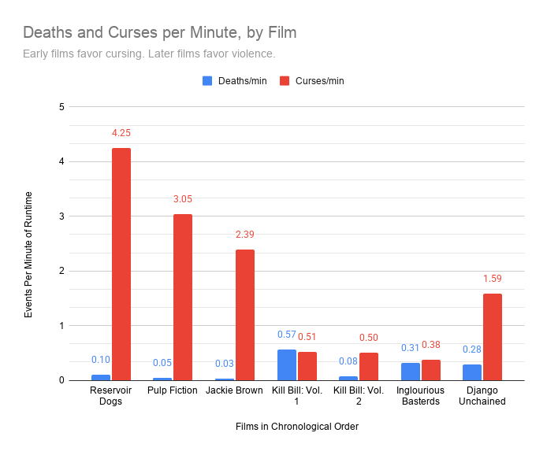
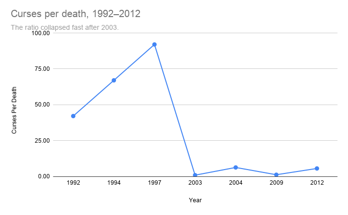
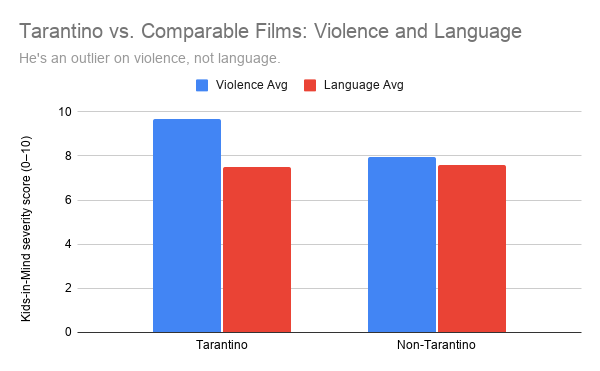

# Quentin Tarantino's Foul Mouth Is Overrated. His Body Count Isn't.
## The Data at Hand
### Data Sourcing and Acquistion
The data for this project comes from two origins. The [primary dataset](https://github.com/fivethirtyeight/data/tree/master/tarantino) comes from FiveThirtyEight's 2015 article, ["A Complete Catalog Of Every Time Someone Cursed Or Bled Out In A Quentin Tarantino Movie" by Oliver Roeder](https://archive.org/details/fivethirtyeight-image-f37bf899f3a7), which captures the traits of a 20-year-long filmography. There are, of course, three movies missing from this list: *Death Proof* (2007), *The Hateful Eight* (2015), and *Once Upon a Time... in Hollywood* (2019). The last two films hadn’t been released at the time of publishing, though *Death Proof* had. I unfortunately haven’t been able to find a definitive reason pointing to why it wasn’t catalogued within the article or dataset, but one possibility could be that *Death Proof* was released as half of *Grindhouse*, a joint project with Robert Rodriguez, and may not have been considered a purely Tarantino film for the purposes of cataloging. 
As a fan of Tarantino's films, I knew I wanted to work with this data once I found it in the [Data Is Plural archive](https://docs.google.com/spreadsheets/d/1wZhPLMCHKJvwOkP4juclhjFgqIY8fQFMemwKL2c64vk/edit?gid=0#gid=0). In thinking about what to compare it against, I began to wonder whether films from similar genres and time periods matched Tarantino's numbers, or whether his films were genuine outliers. This led me to [Kids-in-Mind](https://kids-in-mind.com/), a website that rates films on Sex & Nudity, Violence & Gore, and Language, each on a scale of 0 to 10, which could be read as a combined score out of 30, though the site presents each category separately rather than as one number. The site's stated purpose isn't to rate films as "good" or "bad," but to give parents specific information about content. I found the Kids-in-Mind rating for all the Tarantino films in the original FiveThirtyEight dataset, except for *Jackie Brown*, and catalogued their Violence & Gore and Language ratings in a dataset I created. I then added 15 additional films, not by Tarantino, but selected to match his films' genre (crime, action, and thriller) and era, spread roughly across the same three time periods his films span. This gave me a comparison group I could treat as a rough benchmark for violence and language among well-known R-rated films in a similar genre landscape. It's worth noting this comparison group was hand-picked by me for genre, era, and recognizability rather than randomly sampled, a different set of films could shift the average somewhat.
### Data Analysis
Using the raw FiveThirtyEight dataset (1,894 individual death and profanity events), I built a pivot table with Movie as rows and Type (death/curse) as columns, aggregated by count, to get a total death and curse count for each of the seven films.
Raw counts alone were misleading, since the films range from 99 to 165 minutes long, as a longer film will naturally rack up more events regardless of how violent or profane it actually is. To correct for this, I calculated Deaths per minute and Curses per minute for each film by dividing each count by that film's runtime, sourced from [IMDb](https://www.imdb.com).
This revealed a clear pattern that the raw counts alone obscured: Tarantino's first three films (*Reservoir Dogs*, *Pulp Fiction*, *Jackie Brown*, 1992–1997) are extremely profanity-dense but with very few deaths in comparison, *Reservoir Dogs* averages 4.25 curses per minute against just 0.10 deaths per minute. Starting with *Kill Bill: Vol. 1* (2003), that relationship flips: the death rate jumps roughly 19-fold to 0.57 per minute, while cursing drops sharply. I calculated a curses-to-deaths ratio for each film to quantify this shift directly. *Jackie Brown* has roughly 92 curses for every on-screen death, while *Kill Bill: Vol. 1* is nearly 1-to-1.
Separately, using the Kids-in-Mind dataset I compiled, I calculated the average Violence and Language severity scores (0–10 scale) across Tarantino's six rated films versus my 15-film comparison group using `AVERAGEIF`. Tarantino's films average 9.67 on Violence versus 7.93 for the comparison group, a quantified meaningful gap. On Language, however, the two groups are nearly identical (7.5 vs. 7.6), suggesting Tarantino's film’s reputations for exceptionally foul dialogue may not hold up against their similarly-rated genre peers, even though his internal curse-to-death ratio shifted dramatically over his career.
### Data Visualization

This first chart visualizas the deaths and curses per minute of runtime across Tarantino's seven films, controlling for length. *Kill Bill: Vol. 1* (2003) is the only film in the dataset where the death rate exceeds the curse rate. Source: FiveThirtyEight, "A Complete Catalog Of Every Time Someone Cursed Or Bled Out In A Quentin Tarantino Movie"; runtime data from IMDb. Calculated by author.

This second chart visualizes the ratio of curses to on-screen deaths per film, in chronological order. *Jackie Brown* has roughly 92 curses for every on-screen death, while *Kill Bill: Vol. 1* is nearly 1-to-1 — showing how quickly Tarantino's dialogue-to-violence balance shifted after his first decade of filmmaking. Source: FiveThirtyEight, "A Complete Catalog Of Every Time Someone Cursed Or Bled Out In A Quentin Tarantino Movie." Calculated by author.

This third chart visualizes the average Kids-in-Mind Violence and Language severity scores (0–10 scale) for Tarantino's films (n=6, *Jackie Brown* excluded due to no entry) versus 15 comparable R-rated crime, action, and thriller films from the same eras. Tarantino's films score notably higher on violence, but his language scores are nearly identical to genre peers — suggesting his reputation for exceptionally foul dialogue may not hold up against similarly-rated films. Source: Kids-in-Mind (kids-in-mind.com). Calculated by author.
## Methods and Limitations
### Methods
This project combines two datasets rather than one. The primary dataset (deaths and curses) comes from FiveThirtyEight's own reporting; the benchmark dataset (Kids-in-Mind severity scores) was compiled by me specifically for this project. I normalized the FiveThirtyEight counts by runtime (deaths per minute, curses per minute) to make films of different lengths comparable, and calculated a curses-to-deaths ratio to track how that balance shifted over time. Separately, I averaged Kids-in-Mind's Violence and Language scores across Tarantino's films and a hand-picked comparison group of 15 films to see how he measures up against genre peers.
### Limitations
Unclear Definitions: FiveThirtyEight does not publish the exact criteria used to decide what counts as a "curse" or a "death" in its dataset;  for example, whether repeated uses of the same word in quick succession were each logged separately. A different coder following different rules might arrive at different totals.
Missing Data: *Jackie Brown* has no Kids-in-Mind entry, so it's excluded from the Violence/Language averages (Chart 3) but included in the deaths/curses analysis (Charts 1 and 2). Additionally, three Tarantino films, *Death Proof*, *The Hateful Eight*, and *Once Upon a Time... in Hollywood*, are not part of the FiveThirtyEight dataset at all, so this project covers only his 1992–2012, seven-film run, not his full filmography.
Two Different Measurement Systems: The FiveThirtyEight data is a raw, granular count of individual events. Kids-in-Mind's data is a subjective 0–10 severity score assigned by the site's reviewers, whose grading criteria aren't fully public. These measures related but not identical things, so Chart 3's comparison should be read as approximate rather than as a precise statistic.
Non-Random Comparison Sample: The 15 non-Tarantino films were hand-picked by me for genre fit, era, and general recognizability, not randomly sampled from all films released in that window. A larger or differently chosen sample could shift the comparison averages.
## The Wrap-Up 
### Conclusion
Across Quentin Tarantino's first seven films, violence and profanity didn’t move together, they traded places. His earliest films are dense with foul language and comparatively light on on-screen death; starting with *Kill Bill: Vol. 1* in 2003, that balance reversed, with death rates climbing sharply while cursing dropped. But when measured against 15 well-known R-rated crime and action films from the same eras, Tarantino's reputation as an unusually foul-mouthed filmmaker doesn't fully hold up, his Language scores are nearly identical to his peers'. His real outlier, by this measure, is violence, not language. The popular image of Tarantino as the profanity-obsessed director appears to be more about how memorably his dialogue is written than how much more he actually swears compared to other films in his genre.
### Ethical Considerations
Reducing a film's violence and language to a numeric count risks flattening artistic choices into a trivia statistic, stripping away the narrative or historical context that gives that content meaning. *Django Unchained's* frequent use of racial slurs, for instance, is inseparable from its subject matter, but a raw word count treats it identically to a slur used gratuitously elsewhere. This project doesn't attempt to evaluate why Tarantino makes these choices or whether they're artistically justified; it only measures frequency. A reader shouldn't walk away thinking "more swearing or deaths" means "worse" or "more gratuitous,” that's a separate, more subjective question this data can't answer.
There's also a risk in treating the Kids-in-Mind's scores, designed for parents deciding what's appropriate for children, as a stand-in for "how extreme" a film is in a broader cultural or artistic sense. A rating system built for content warnings isn't the same as a critical framework, and using it that way risks importing a moralizing lens the site itself doesn't necessarily intend.
### Where This Story Could Go Next
To make this a fuller and more rigorous story, I'd want: a second person to independently verify the FiveThirtyEight counts and my own Kids-in-Mind data collection, to check for consistency; a larger and possibly randomly sampled comparison group rather than a hand-picked one; and critical or historical context, ideally from film scholars or critics, on why Tarantino's ratio of violence to language shifted the way it did after 2003, since the data can show the pattern but not explain the creative reasoning behind it.
